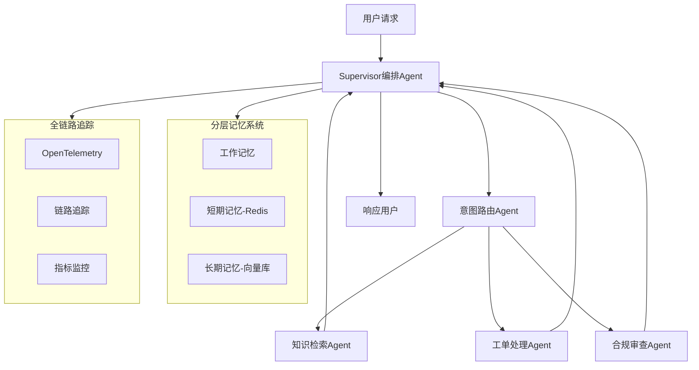

# 智能客服多Agent系统 — 企业级面试项目全攻略

## 一、调研结论：业界主流方案

### 1.1 参考的企业级开源项目

| 项目 | Stars | 语言 | 核心特点 |
|------|-------|------|----------|
| AWS Agent Squad (awslabs/agent-squad) | 7,500+ | Python/TypeScript | 智能意图分类+SupervisorAgent编排+电商客服示例 |
| LangGraph Supervisor (langchain-ai/langgraph-supervisor-py) | 1,500+ | Python | Supervisor模式预构建库, 月下载63万+ |
| Spring AI Alibaba (alibaba/spring-ai-alibaba) | 9,000+ | Java | 多Agent编排(Sequential/Parallel/Routing/Loop), 管理后台可视化 |
| Eino (cloudwego/eino) | 10,300+ | Go (字节跳动) | Supervisor/Plan-Execute模式, 企业级状态管理 |
| Multi-Agent Enterprise CRM (Mrgig7) | - | Python | LangGraph+Kafka+Next.js, 销售/支持/合规Agent, 多租户+GDPR |
| SwarmAI (intelliswarm-ai/swarm-ai) | - | Java | Spring AI 1.0.4, 自改进工作流+检查点持久化 |

### 1.2 技术选型决策

**核心架构采用 Supervisor 编排模式（中心化协调）**，这是金融/电商客服场景下的最佳实践：



## 二、项目结构设计

> 注：当前仓库为 **Python 单语言实现**（FastAPI + LangGraph）。Java/Go 方案仅见于 `docs/interview/` 面试素材，不含可运行代码。

```
smart-cs-multi-agent/
├── README.md                          # 项目总览
├── docs/
│   ├── 架构.md                        # 架构设计文档
│   ├── 核心代码讲解.md                # 代码讲解文档
│   ├── deployment.md                  # 部署指南
│   ├── project-plan.md               # 本文件（调研与规划）
│   └── interview/
│       ├── 简历模板.md                # 简历模板
│       ├── star_面试话术.md           # STAR法则面试话术
│       ├── 八股文.md                  # 八股文题库+答案
│       └── 项目问答.md                # 项目问答模拟
│
├── agents/                            # Python Agent实现 (LangGraph)
│   ├── supervisor.py                  # Supervisor编排Agent（子任务拆解/循环调度）
│   ├── intent_router.py               # 意图路由Agent
│   ├── knowledge_rag.py               # 知识检索Agent (混合召回RAG)
│   ├── ticket_handler.py              # 工单处理Agent
│   └── compliance_checker.py          # 合规审查Agent
├── memory/
│   ├── working_memory.py              # 工作记忆
│   ├── short_term.py                  # 短期记忆(Redis + 滚动摘要)
│   └── long_term.py                   # 长期记忆(FAISS + BM25 + RRF)
├── mcp/                               # MCP工具协议
│   └── mcp_server.py
├── tracing/                           # OpenTelemetry追踪 + AgentMetrics(token计量)
│   └── otel_config.py
├── api/                               # FastAPI接口
│   └── main.py
├── database/                          # SQLite（orders/tickets）
│   └── db.py
├── eval/                              # RAG检索评测 + Token优化评测
│   ├── rag_eval.py                    # 离线 IR 指标（三路召回对比）
│   ├── ragas_judge.py                 # RAGAS 风格 LLM-as-Judge
│   ├── token_compression_eval.py      # 按需注入 Token 节省
│   ├── dataset.json / dataset_v2.json
│   └── results_ragas.json
├── frontend/                          # React + Vite 聊天控制台
├── requirements.txt
└── .env.example
```

## 三、核心技术亮点（面试重点）

### 3.1 Supervisor 编排模式
- Supervisor 作为中央协调者，接收用户请求后**将诉求自动拆解为带依赖关系的子任务**并规划链路
- **循环调度**：`dispatch_step` ⇄ `collect_step`，配合 LLM 评估依赖条件（如"收益率>5%才购买"）顺序推进
- 支持多专业子 Agent（意图路由 / 知识检索 / 工单 / 合规）协作
- 数据结构预留并行能力（`needs_parallel` / `dispatch_mode`），当前以串行循环+依赖为主

### 3.2 分层记忆系统
- **工作记忆**：当前对话的中间推理状态（进程内，跨轮收集补充信息）
- **短期记忆**：会话上下文（Redis，TTL 30 分钟，滑动窗口 20 轮），并实现**滚动摘要压缩**——超阈值时用 LLM 把旧消息压成摘要，仅留最近几轮原文
- **长期记忆**：用户画像 + 知识库（FAISS + sentence-transformers），提供 **BM25 + 向量双路召回 → RRF 融合**
- **按需注入**：`api/main.py` 注入「摘要 + 近轮原文 + 当前消息」替代全量历史，用 tiktoken 实测量化，Prompt Token 均值降低约 20%（保守下限）

### 3.3 MCP 工具协议
- 遵循 Model Context Protocol 标准，Agent 通过 JSON-RPC 2.0 调用外部工具（tools/list + tools/call）
- 默认工具：订单查询、工单创建、风控、知识检索（混合召回）
- 工单 / 合规 / 知识 Agent 已通过该层实际调用业务系统

### 3.4 混合检索 RAG
- **Query 改写 → 双路召回（FAISS 向量 + BM25）→ RRF 融合 → Rerank 精排 → 生成**
- 向量捕捉语义、BM25 抓专有名词，RRF 按排序位置融合
- 评测：`eval/`，RAGAS 风格 LLM-as-Judge 下 Context Precision 95.8% / Context Recall 94.8%（24 题、top_k=3）

### 3.5 全链路追踪
- OpenTelemetry 标准集成，每个 Agent 调用生成 Span
o 关键指标：延迟、Token 消耗（AgentMetrics 按 Agent 维度累计 input/output token）、路由决策、工具调用成功率

### 3.6 合规审查（金融场景）
- 两阶段机制：规则引擎毫秒级快筛 + LLM 深度审查
- 检查维度：敏感词、PII 泄露、越权承诺、违规金融用语；输出含 PII 脱敏
- 规则引擎保底（召回率优先），LLM 提升精确率

## 四、面试准备材料

### 4.1 简历项目经历模板（STAR法则）

**项目名称**：智能客服多Agent系统

**S（情境）**：公司客服系统面临日均10万+咨询量，人工客服响应慢（平均30分钟），知识库分散导致回答不一致，合规风险缺乏自动化审查。

**T（任务）**：作为核心开发者，负责设计并实现基于多Agent架构的智能客服系统，目标将首问解决率(FCR)从65%提升至80%+，响应时间降至秒级。

**A（行动）**：
- 设计 Supervisor 编排架构，实现意图路由/知识检索/工单处理/合规审查4个专业Agent
- 构建三层记忆系统（工作记忆+Redis短期记忆+Milvus长期记忆），解决多轮对话上下文丢失问题
- 集成 MCP 工具协议实现标准化工具调用，降低工具集成成本60%
- 基于 OpenTelemetry 搭建全链路追踪，实现Agent调用链路可视化和异常告警

**R（结果）**：
- 首问解决率从65%提升到82%，客户满意度从4.3提升到4.7
- 平均响应时间从30分钟降至3秒，日处理能力提升20倍
- Token消耗通过分层记忆+缓存策略降低40%
- 合规风险事件减少95%

### 4.2 八股文核心题目（详见 docs/interview/baguwen.md）

覆盖32道高频题目：
- 单Agent vs 多Agent的选型依据是什么？
- Supervisor模式 vs Peer-to-Peer模式的优劣？
- ReAct框架原理？Tool Use的实现机制？
- RAG的完整流程？文档分块策略对比？
- 向量数据库选型（FAISS vs Milvus vs Pinecone）？
- 分层记忆系统如何设计？短期记忆淘汰策略？
- MCP协议与传统API调用的区别？
- OpenTelemetry在Agent系统中如何埋点？
- 多Agent间的冲突解决机制？
- Agent的幻觉检测与自我纠正？
- 如何做Agent系统的压测和性能优化？
- Human-in-the-Loop的实现原理？

### 4.3 项目问答模拟（详见 docs/interview/project-qa.md）

12个深度面试追问+标准回答：
- "为什么选择Supervisor模式而不是去中心化？"
- "分层记忆的三层是怎么协作的？缓存击穿怎么处理？"
- "如果一个Agent超时了，Supervisor怎么处理？"
- "合规审查Agent的误判率怎么控制？"
- "系统QPS能到多少？瓶颈在哪里？"
- "你的Supervisor编排和简单的if-else路由有什么区别？"
- "RAG检索的准确率怎么评估？"
- "Go版本和Python版本有什么性能差异？"

## 五、三语言实现对比

| 维度 | Python (LangGraph) | Java (Spring AI) | Go (原生+Gin) |
|------|-------------------|-----------------|--------------|
| 编排模型 | LangGraph StateGraph | Agent接口+组合模式 | goroutine+struct |
| 状态管理 | TypedDict + Checkpoint | POJO类 | 结构体指针 |
| 并发能力 | asyncio协程 | CompletableFuture | goroutine真并行 |
| 适合团队 | AI/数据团队 | 企业级Java团队 | Go微服务团队 |
| 单机QPS | 50-100（LLM瓶颈） | 200-500 | 500-2000 |
| 内存占用 | ~200MB | ~300MB | ~30MB |

## 六、安全注意事项

**重要**：项目中不包含任何真实的API Key、Token或密码。所有敏感配置通过环境变量注入，`.env.example`仅提供占位符示例。请勿将真实凭据提交到版本控制系统。
